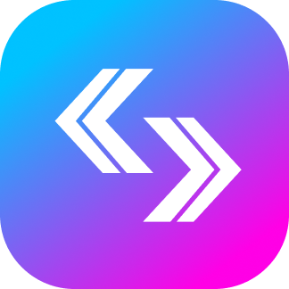
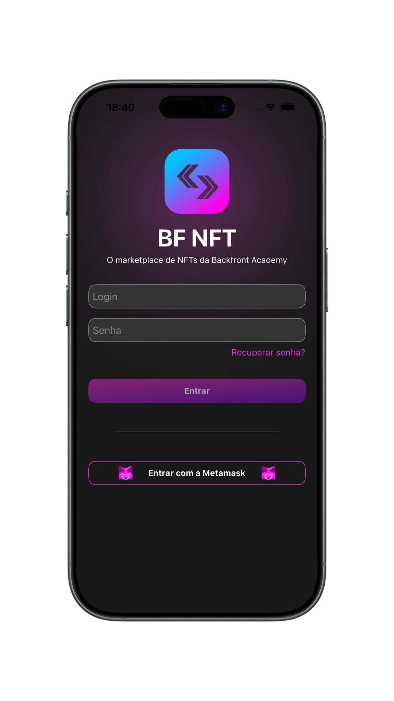
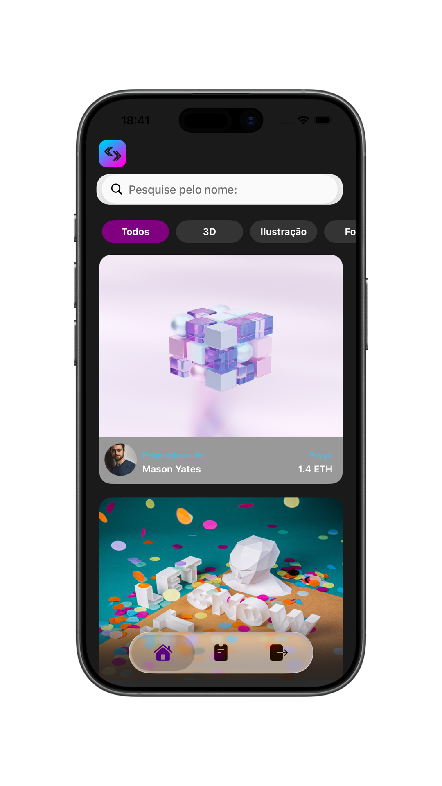
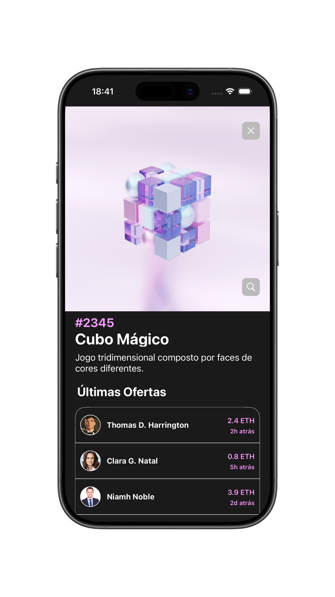
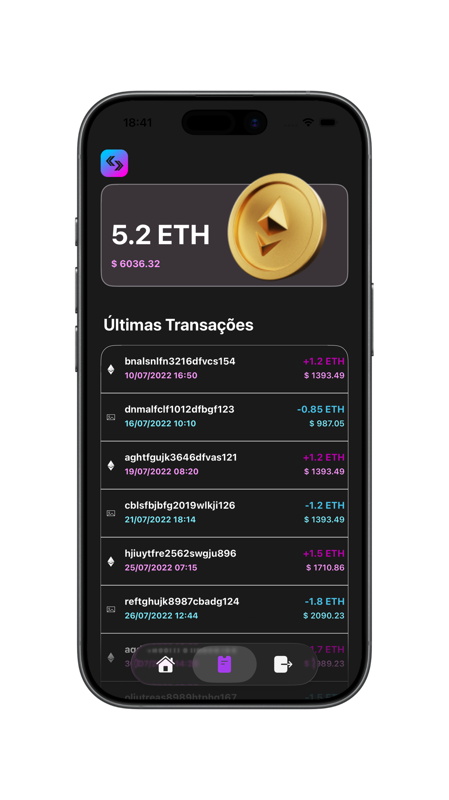
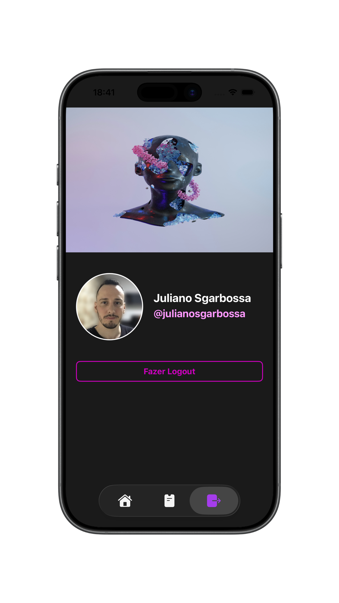

<div align="center">
  

  # BF-NFT

  Um aplicativo iOS para explorar NFTs, acompanhar ofertas e consultar uma carteira de Ethereum.

  [](https://www.swift.org/)
  [](https://developer.apple.com/documentation/uikit)
  [](#arquitetura)
  
</div>

## 📱 Sobre o projeto

O **BF-NFT** é um aplicativo iOS que simula a experiência de um marketplace de NFTs. Após realizar o login, o usuário pode explorar um catálogo de obras digitais, pesquisar por criadores, filtrar os itens por categoria e acessar informações detalhadas de cada NFT, incluindo descrição, identificação e histórico de ofertas.

O app também apresenta uma carteira digital com saldo em Ethereum, valor convertido em dólar e histórico de transações. Na área de perfil, o usuário visualiza seus dados e pode encerrar a sessão.

Desenvolvido em **Swift**, o projeto utiliza **UIKit com View Code** e arquitetura **MVVM**. A autenticação é feita com **Firebase Authentication**, enquanto os dados podem ser carregados remotamente com **Alamofire** ou por arquivos JSON locais.

## 🖼️ Demonstração

<p align="center">
  
  
  
  
  
</p>

## ✨ Funcionalidades

- Autenticação por e-mail e senha com Firebase Authentication
- Catálogo de NFTs com busca por nome de usuário
- Filtros por categoria
- Detalhes do NFT e histórico de ofertas
- Visualização ampliada da imagem do NFT
- Carteira com saldo em ETH, conversão em dólar e últimas transações
- Perfil do usuário
- Leitura de dados por API ou arquivos JSON locais

## 🛠️ Tecnologias

| Tecnologia | Uso no projeto |
| --- | --- |
| Swift 5 | Linguagem principal |
| UIKit + View Code | Construção da interface sem Storyboards |
| MVVM | Organização das responsabilidades das telas |
| Firebase Authentication | Autenticação dos usuários |
| Alamofire | Requisições HTTP e decodificação das respostas |
| AlamofireImage | Carregamento e cache de imagens remotas |
| Swift Package Manager | Gerenciamento das dependências |

<a id="arquitetura"></a>

## 🏗️ Arquitetura

O código está organizado por funcionalidades. Cada fluxo principal possui sua própria `ViewController`, `Screen` e `ViewModel`, enquanto modelos, serviços, recursos e extensões ficam em camadas compartilhadas.

```text
BF-NFT/
├── App/             # Ciclo de vida e ponto de entrada
├── Features/        # Telas e componentes organizados por fluxo
├── Model/           # Modelos de domínio e respostas de dados
├── Service/         # Acesso a APIs e arquivos JSON locais
├── Json/            # Dados mockados para desenvolvimento
├── Resourcers/      # Imagens, cores e demais assets
└── Utils/           # Extensões e utilitários compartilhados
```

O fluxo de uma tela segue, de forma simplificada:

```text
Screen → ViewController ⇄ ViewModel → Service → API / JSON
```

## 🚀 Como executar

1. Clone o repositório:

   ```bash
   git clone https://github.com/julianosgarbossa/BF-NFT.git
   cd BF-NFT
   ```

2. Crie um projeto no [Firebase Console](https://console.firebase.google.com/) e configure:

   - Adicione um app iOS com o Bundle ID `br.com.julianosgarbossa.BF-NFT`.
   - Em **Authentication → Sign-in method**, habilite **E-mail/senha**.
   - Em **Authentication → Users**, crie um usuário com e-mail e senha para acessar o app, que ainda não possui tela de cadastro.
   - Baixe o `GoogleService-Info.plist` e coloque-o em `BF-NFT/GoogleService-Info.plist`.

3. Abra o projeto:

   ```bash
   open BF-NFT.xcodeproj
   ```

4. Aguarde as dependências serem carregadas, selecione um simulador e execute com `⌘R`.

> O `GoogleService-Info.plist` está incluído no `.gitignore`. Mantenha esse arquivo apenas no seu ambiente local e não o envie em commits.
